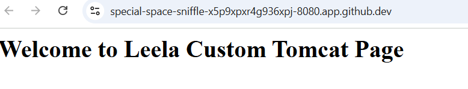
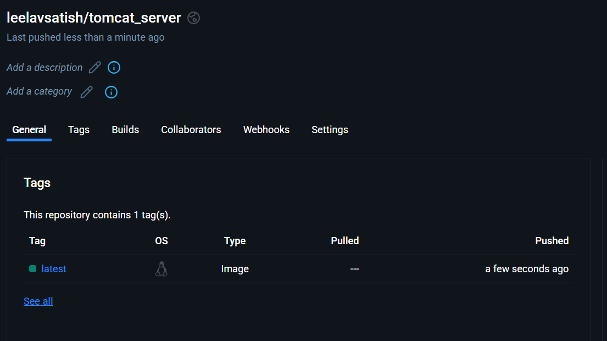

# senpipertask

1. Find the count of log statements in the attached(as access.log.zip) file “access.log”
with successful response (status code 200).
    
    Soultion: I have writtern a python code to read the access.log file to find pattern of status code 200 and counted the instances to get the final count. Please check count_success_access_log.py for the same

2. Write a command to find the files which contain words DEBUG, ERROR, and INFO
in any directory of the filesystem.
    
    
    Solution: grep -rlw -e "DEBUG" -e "ERROR" -e "INFO" /

3. What would be the sed command to convert the string input "Ab1Cd2Ef3Gh4Ij5….."
to "a-bc-de-fg-hi-j…."?

    Solution: 
        Here we need to covert all the upper case alphabet to lower case and replace numbers with eiphen between every 2 letters.

        sed command is : echo "Ab1Cd2Ef3Gh4Ij5K" | tr '[:upper:]' '[:lower:]' | sed -E 's/[0-9]//g; s/(.)(.)/\1-\2/g'

4. Write a script/program to return true if the opening and closing braces are
complete, otherwise false.

    e.g:

    a. Input string:
        List { information {{about the FILEs (the current directory by default). Sort entries
        alphabetically if} none of -cftuvSUX }nor --sort } is specified.
        
        Output: True

    b. Input string:
        Performs { the specified action on the files. { Valid actions are view, cat (uses only
        "copious output" rules { and sends output to STDOUT) , compose, com‐posetyped, edit and
        print. If no action is specified, the action will be determined by how the program was called.}
        
        Output: False

5. Write steps to create and publish a docker image to the docker repository.
    e.g., Run tomcat image with a customized landing page, and should be accessible at:
    http://localhost:8080/

    Solution: Steps for creating and publishing a docker image to docker repository
        
        1. creating folder for tomcat server and creating a customer index.html
            mkdir tomcat_server
            cd tomcat_server
            mkdir webapp
            cd webapp
            echo "<html><body><h1>Welcome to Leela Custom Tomcat Page</h1></body></html>" > webapps/index.html
        2. creating Dockerfile and using Dockerfile creating docker image and running the same in port 8080
            docker build -t tomcat_server .
            docker run -d -p 8080:8080 tomcat_server
    
        
        3. Publishing the image to dockerhub by logging into dockerhub and pushing the image as follows
            docker login -u leelavsatish -p ${{ secrets.DOCKER_PASS }}
            docker tag tomcat_server:latest leelavsatish/tomcat_server:latest
            docker push leelavsatish/tomcat_server:latest
    